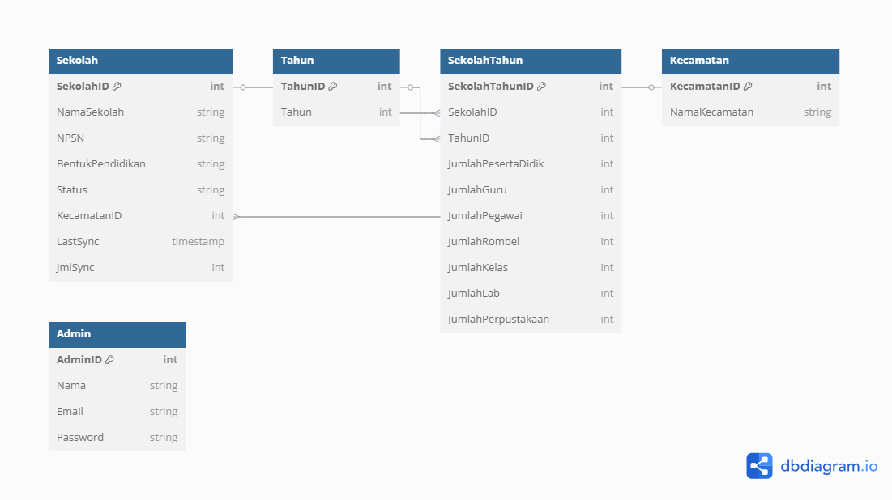

# 📌 Project Name

## 📖 Overview

Aplikasi ini digunakan untuk mengelola data sekolah, termasuk peserta didik, guru, pegawai, dan fasilitas.  
Masyarakat dapat melihat data sekolah, tetapi hanya **admin** yang memiliki akses untuk melakukan CRUD.

## 🎯 Objectives

-   Memudahkan pencatatan data sekolah
-   Menyediakan **dashboard insight** untuk melihat tren dan perkembangan sekolah
-   Memberikan akses informasi kepada masyarakat
-   Integrasi dengan Filament untuk dashboard interaktif

## 📂 Features

-   **Manajemen data sekolah** (jumlah siswa, guru, pegawai, rombel)
-   **Dashboard Insight** untuk analisis dan tren sekolah
-   **Statistik Umum** seperti jumlah sekolah, fasilitas, dan tenaga pendidik
-   **Sistem Autentikasi Admin** untuk pengelolaan data

## 📌 Database Diagram

## ✅ How to Contribute

### 1. Setup Environment

Pastikan file .env sudah dikonfigurasi dengan MySQL sebagai database utama.

Contoh konfigurasi .env:

DB_CONNECTION=mysql
DB_HOST=127.0.0.1
DB_PORT=3306
DB_DATABASE=nama_database
DB_USERNAME=root
DB_PASSWORD=yourpassword

### 2. Install Dependencies

Jalankan perintah berikut untuk menginstal dependensi:

composer install

### 3. Jalankan Migrasi dan Seeder

Setelah konfigurasi .env benar, jalankan perintah berikut:

php artisan migrate --seed

Perintah ini akan membuat tabel di database dan mengisi data awal.
